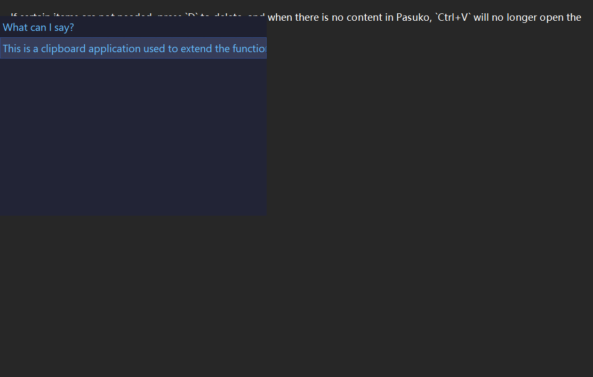

<strong>
<samp>

[English](README.md) · [简体中文](README.zh.md) · [日本語](README.ja.md) ·
[한국어](README.ko.md) · [Español](README.es.md) · [Português](README.pt-br.md) ·
[Русский](README.ru.md) · [Francais](README.fr.md) · [Uzbek](README.uz.md) · [Deutsch](README.de.md) ·
[Türkçe](README.tr.md)

</samp>
</strong>

---
Dies ist eine Zwischenablage-Anwendung, die verwendet wird, um die Funktionalität der ursprünglichen Windows-Zwischenablage zu erweitern.

## Gebrauchsanweisung

- Nach dem Öffnen von Pasuko kann durch Drücken der Tastenkombination `Ctrl+V` das Panel geöffnet werden (natürlich müssen Sie sicherstellen, dass Sie nach dem Öffnen von Pasuko etwas kopiert haben), und der Inhalt im Panel wird nach Zeit sortiert.

- Drücken Sie `J` und `K`, um die Auswahl nach oben und unten zu bewegen, drücken Sie Tab, um das ausgewählte Element an der aktuellen Cursorposition einzugeben; beachten Sie, dass dies ein Zeichen nach dem anderen eingibt.

- Wenn Sie zu viele Einträge kopieren, können Sie im normalen Modus die `F`-Taste drücken, um in den Suchmodus zu wechseln. Dieser Modus fügt ein Textfeld (Bearbeitung) hinzu; geben Sie Text ein, um zu suchen, genau wie bei der Nutzung anderer Editoren mit Eingabeaufforderungen. Nachdem Sie den benötigten Inhalt gefunden haben, drücken Sie die Eingabetaste, verwenden Sie `J` und `K`, um auszuwählen, `Tab`, um einzugeben, und nach Abschluss der Eingabe kehrt es in den normalen Modus zurück. Wenn Sie die Suche abbrechen oder das Ergebnis nicht Ihren Erwartungen entspricht, drücken Sie `Esc`, um die Suche zu verlassen.

- Drücken Sie `I`, um im Normalmodus in den Bearbeitungsmodus zu wechseln, in dem Sie den Text in jedem Eintrag ändern können, drücken Sie `Enter`, um zu speichern, und drücken Sie `Esc`, um abzubrechen.

- Wenn bestimmte Elemente nicht benötigt werden, drücken Sie `D`, um sie zu löschen, und wenn kein Inhalt in Pasuko vorhanden ist, öffnet `Ctrl+V` das Panel nicht mehr.

  

- Drücken Sie `Esc`, um das Panel zu schließen, Sie finden Pasuko im Tray, `Ctrl+Shift+V` ist für das originale Einfügen.

> [!TIP]
> |Normal|Tasten|Funktion|
> |---|---|---|
> ||J|Nächstes Element auswählen|
> ||K|Vorheriges Element auswählen|
> ||Tab|Ausgewähltes Element eingeben|
> ||F|Suchen|
> ||I|Bearbeiten|
> ||D|Löschen|
> ||Esc|Panel schließen|
> |Suchen|||
> ||Enter|Element suchen|
> ||Esc|Suche abbrechen|
> |Bearbeiten|||
> ||Enter|Bearbeitung abgeschlossen|
> ||Esc|Bearbeitung abbrechen|

---
PS: In einigen Chromium-basierten Programmen kann es bei der Verwendung von Pasuko vorkommen, dass der Cursor nicht korrekt positioniert wird. In diesem Fall wird das Panel in der oberen linken Ecke angezeigt.
