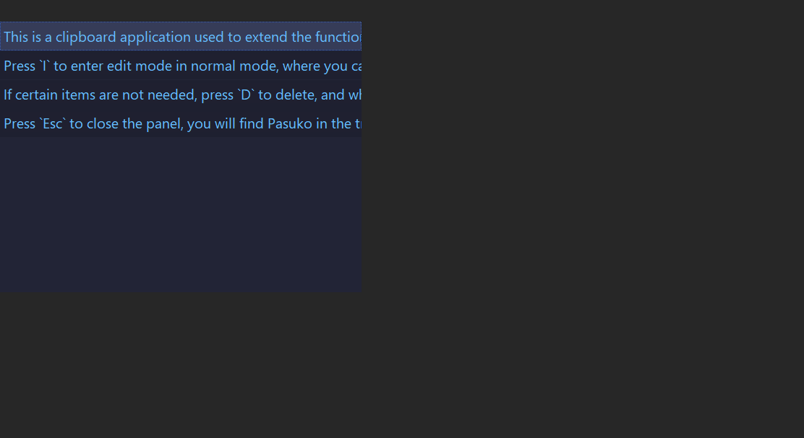
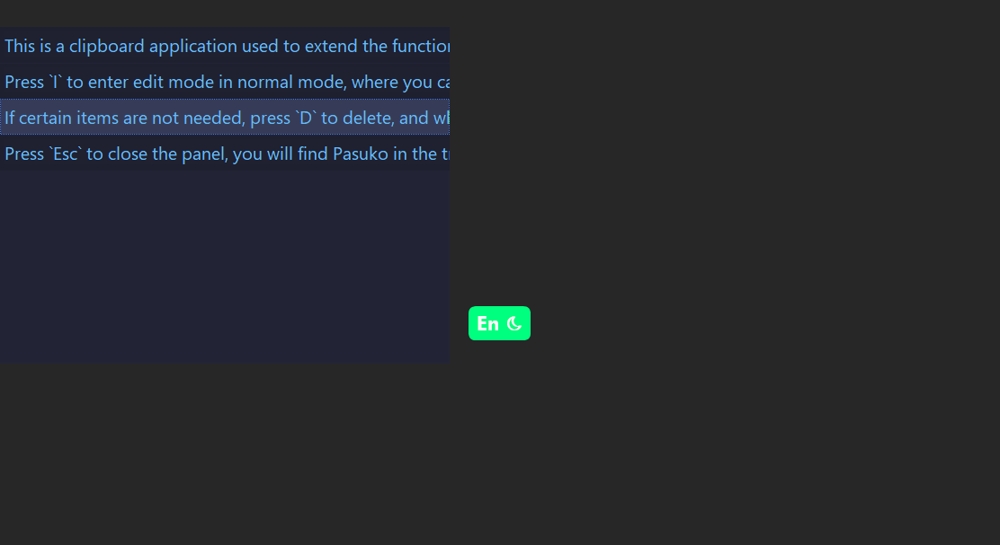
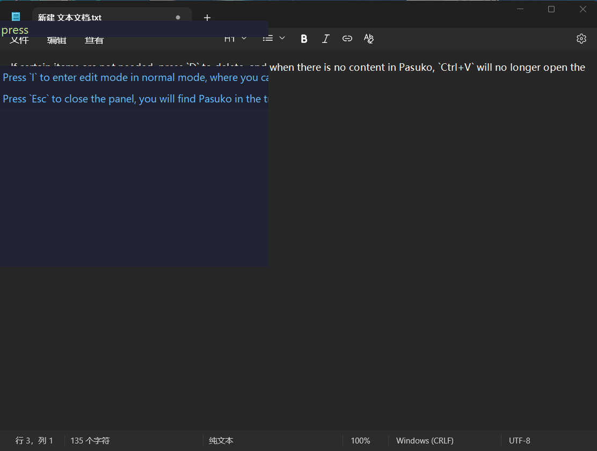
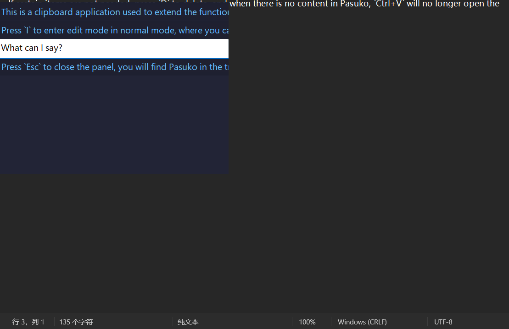
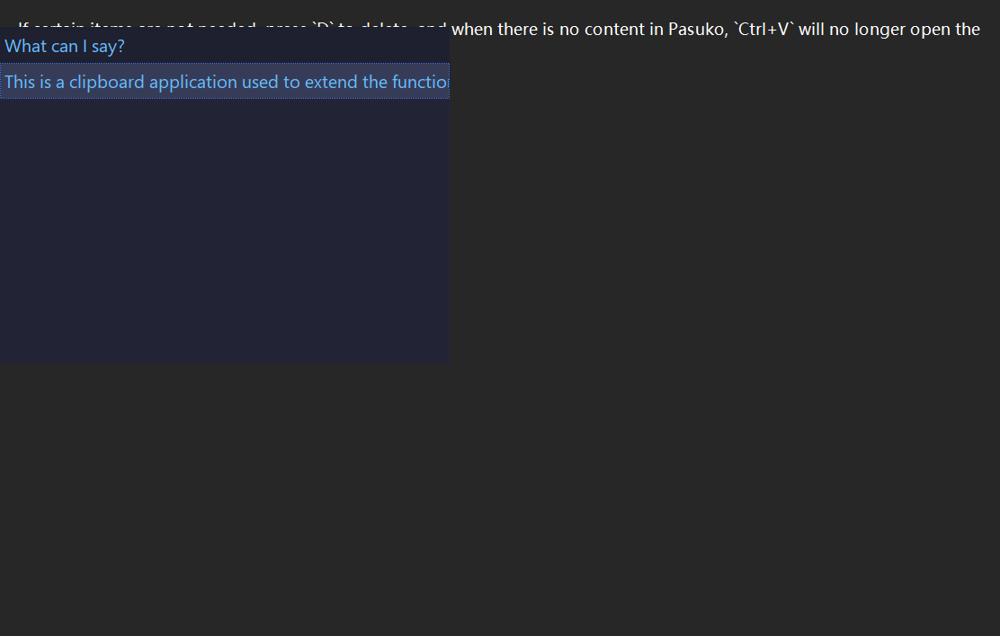
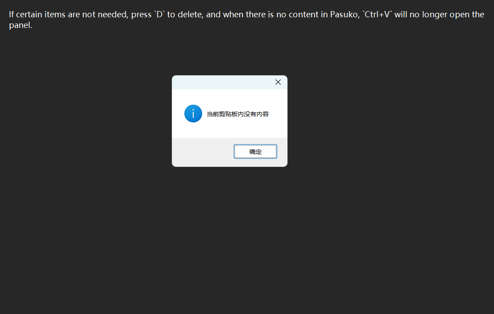

# Pasuko

   

<strong>
<samp>

[English](README.md) · [简体中文](README.zh.md) · [日本語](README.ja.md) ·
[한국어](README.ko.md) · [Español](README.es.md) · [Português](README.pt-br.md) ·
[Русский](README.ru.md) · [Francais](README.fr.md) · [Uzbek](README.uz.md) · [Deutsch](README.de.md) ·
[Türkçe](README.tr.md)

</samp>
</strong>

---
Esta es una aplicación de portapapeles utilizada para ampliar la funcionalidad del portapapeles original de Windows

## Instrucciones de uso

- Después de abrir Pasuko, presionar la combinación de teclas `Ctrl+V` puede abrir el panel (por supuesto, necesitas asegurarte de haber copiado algo después de abrir Pasuko), y el contenido en el panel se ordena por tiempo.

- Presiona `J` y `K` para mover la selección hacia arriba y abajo, presiona `Tab` para ingresar el elemento seleccionado en la posición actual del cursor; ten en cuenta que esto ingresa un carácter a la vez.

- Si copias demasiadas entradas, puedes optar por presionar la tecla `F` en el modo normal para entrar en el modo de búsqueda. Este modo agrega un cuadro de texto (editar); ingresa el texto para buscar, tal como se haría en otros editores con indicaciones. Después de encontrar el contenido que necesitas, presiona Enter, usa `J` y `K` para seleccionar, `Tab` para ingresar, y una vez que la entrada esté completa, volverá al modo normal. Si deseas cancelar la búsqueda o el resultado no es lo que deseas, presiona `Esc` para salir de la búsqueda.

- Presiona `I` para entrar en el modo de edición desde el modo normal, donde puedes modificar el texto de cada elemento, presiona `Enter` para guardar y presiona `Esc` para descartar.

- Si ciertos elementos no son necesarios, presione `D` para eliminar, y cuando no haya contenido en Pasuko, `Ctrl+V` ya no abrirá el panel.

  

- Presiona `Esc` para cerrar el panel, encontrarás Pasuko en la bandeja, `Ctrl+Shift+V` es para pegar el contenido original.

> [!TIP]
> |Normal|Teclas|Función|
> |---|---|---|
> ||J|Seleccionar el siguiente elemento|
> ||K|Seleccionar el elemento anterior|
> ||Tab|Ingresar elemento seleccionado|
> ||F|Buscar|
> ||I|Editar|
> ||D|Eliminar|
> ||Esc|Cerrar panel|
> |Buscar|||
> ||Enter|Buscar elemento|
> ||Esc|Cancelar búsqueda|
> |Editar|||
> ||Enter|Edición completada|
> ||Esc|Cancelar edición|

---
PD: En algunos programas basados en Chromium, usar Pasuko puede no posicionar el cursor correctamente, en cuyo caso el panel aparecerá en la esquina superior izquierda.
