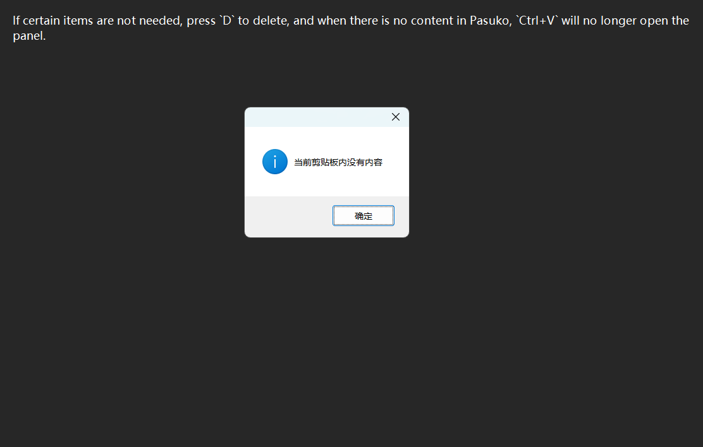

# Pasuko

   

<strong>
<samp>

[English](README.md) · [简体中文](README.zh.md) · [日本語](README.ja.md) ·
[한국어](README.ko.md) · [Español](README.es.md) · [Português](README.pt-br.md) ·
[Русский](README.ru.md) · [Francais](README.fr.md) · [Uzbek](README.uz.md) · [Deutsch](README.de.md) ·
[Türkçe](README.tr.md)

</samp>
</strong>

---
이것은 원래 Windows 클립보드의 기능을 확장하기 위해 사용되는 클립보드 애플리케이션입니다

## 사용 안내

- 파수코를 연 후 `Ctrl+V` 키 조합을 누르면 패널을 열 수 있습니다(물론 파수코를 연 후 무언가를 복사했는지 확인해야 합니다). 패널의 내용은 시간순으로 정렬됩니다.

- `J`와 `K`를 눌러 선택 항목을 위아래로 이동하고, `Tab`을 눌러 선택한 항목을 현재 커서 위치에 입력하세요. 참고로, 한 번에 한 글자씩 입력됩니다.

- 너무 많은 항목을 복사해야 하는 경우, 일반 모드에서 `F` 키를 눌러 검색 모드로 들어갈 수 있습니다. 이 모드는 텍스트 상자(편집)를 추가하며, 검색할 텍스트를 입력하면 다른 프롬프트 편집기처럼 작동합니다. 필요한 내용을 찾으면 Enter 키를 누르고, `J`와 `K` 키로 선택 후, `Tab` 키를 눌러 입력할 수 있습니다. 입력이 완료되면 일반 모드로 돌아갑니다. 검색을 취소하거나 결과가 원하는 것이 아닌 경우, `Esc` 키를 눌러 검색을 종료할 수 있습니다.

- 보통 모드에서 `I`를 눌러 편집 모드로 들어가 각 항목의 텍스트를 수정할 수 있으며, `Enter`를 눌러 저장하고, `Esc`를 눌러 취소할 수 있습니다.

- 필요하지 않은 항목은 `D`를 눌러 삭제하고, Pasuko에 내용이 없으면 `Ctrl+V`를 눌러도 패널이 더 이상 열리지 않습니다.

  

- 패널을 닫으려면 `Esc`를 누르세요. 트레이에서 파스코를 찾을 수 있으며, 원본 붙여넣기는 `Ctrl+Shift+V`입니다.

> [!TIP]
> |일반|키|기능|
> |---|---|---|
> ||J|다음 항목 선택|
> ||K|이전 항목 선택|
> ||Tab|선택한 항목 입력|
> ||F|검색|
> ||I|편집|
> ||D|삭제|
> ||Esc|패널 닫기|
> |검색|||
> ||Enter|항목 검색|
> ||Esc|검색 취소|
> |편집|||
> ||Enter|편집 완료|
> ||Esc|편집 취소|

---
추신: 일부 크로미움 기반 소프트웨어에서는 Pasuko를 사용할 경우 커서 위치가 올바르게 설정되지 않을 수 있으며, 이 경우 패널이 왼쪽 상단 모서리에 나타납니다.
