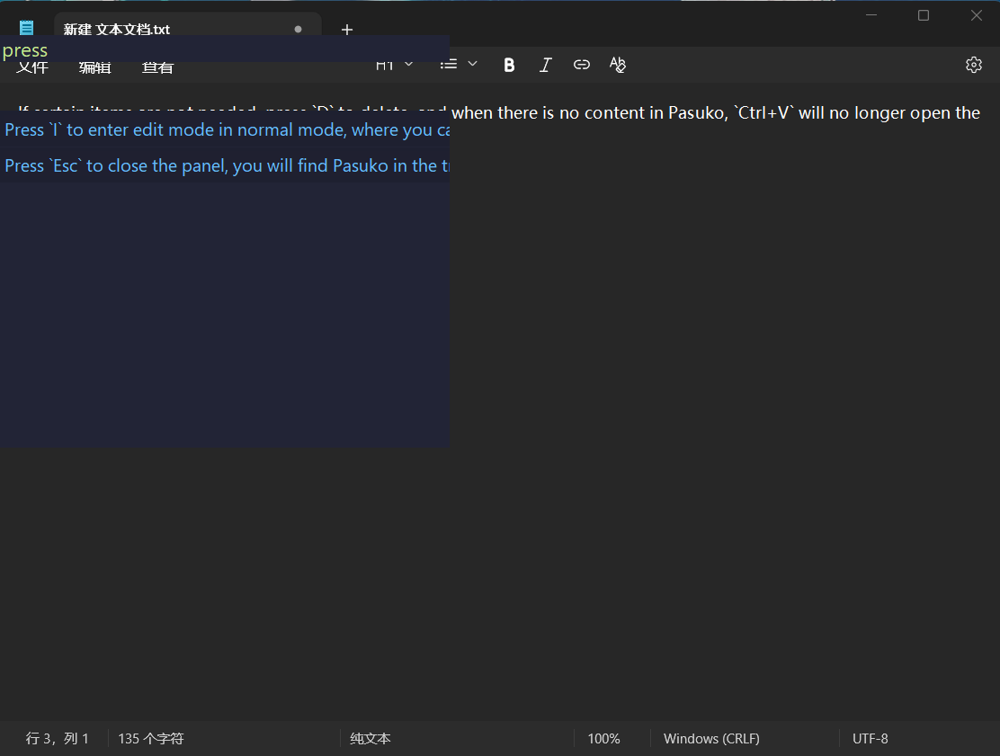
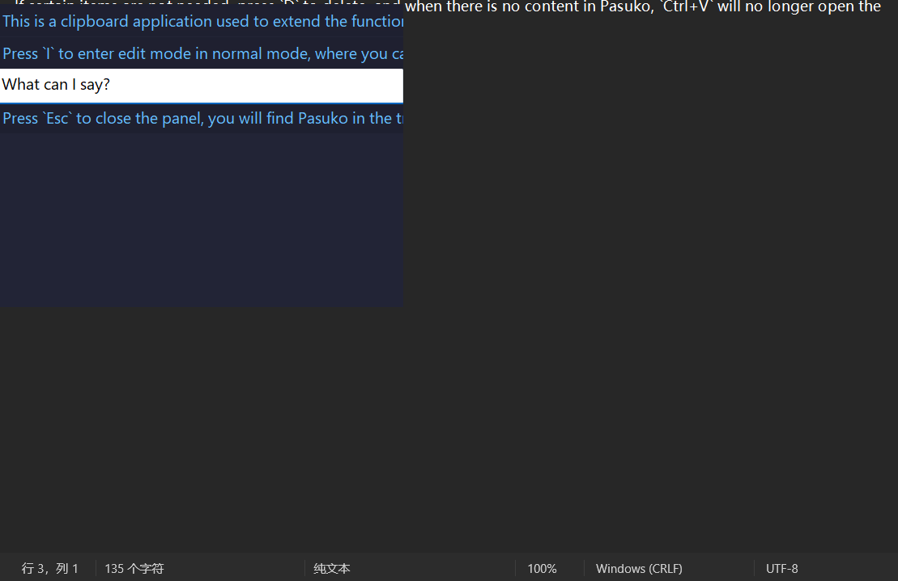

# Pasuko

   

<strong>
<samp>

[English](README.md) · [简体中文](README.zh.md) · [日本語](README.ja.md) ·
[한국어](README.ko.md) · [Español](README.es.md) · [Português](README.pt-br.md) ·
[Русский](README.ru.md) · [Francais](README.fr.md) · [Uzbek](README.uz.md) · [Deutsch](README.de.md) ·
[Türkçe](README.tr.md)

</samp>
</strong>

---
这是一个剪贴板应用，用于扩展windows原版剪贴板的功能喵

## 食用方法：

- 打开Pasuko后，按下组合键`Ctrl+V`可以打开面板（当然，汝需要保证打开Pasuko后复制过内容），面板中的内容是按时间排序的喵です。

- 按J、K键可以上下切换选中项，按Tab将选中项输入当前光标（插入符）处，注意这是逐字输入的喵。

- 如果汝复制的条目过多，汝可以选择在正常模式下按F键进入查找模式。此模式会新增一个文本框(edit)，输入文本查找内容，就如同汝使用其他具有提示的编辑器一样喵~。发现需要的内容后按下Enter，J、K选择，Tab输入，输入完成后就会退回到正常模式。若想取消搜索或该结果是汝不想要的喵です，按Esc退出查找。

- 在正常模式下按I进入编辑模式，此时可以修改各项中的文本，按Enter保存，按Esc不保存。

- 若不需要某些项，按D删除，当Pasuko中没有内容时，`Ctrl+V`将不再打开面板喵~。

  

- 按Esc关闭面板，汝将可以在托盘中找到Pasuko喵，`Ctrl+Shift+V`就是原版粘贴喵です。

> [!TIP]
> |正常|按键|功能|
> |---|---|---|
> ||J|选中下一项|
> ||K|选中上一项|
> ||Tab|输入选中项|
> ||F|查找|
> ||I|编辑选中项|
> ||D|删除项|
> ||Esc|关闭面板|
> |查找|||
> ||Enter|查找项|
> ||Esc|取消查找|
> |编辑|||
> ||Enter|完成编辑|
> ||Esc|取消编辑|

---
ps:在一些Chromium内核的软件使用Pasuko可能会出现定位光标失败的情况，这时面板会出现在左上角。
